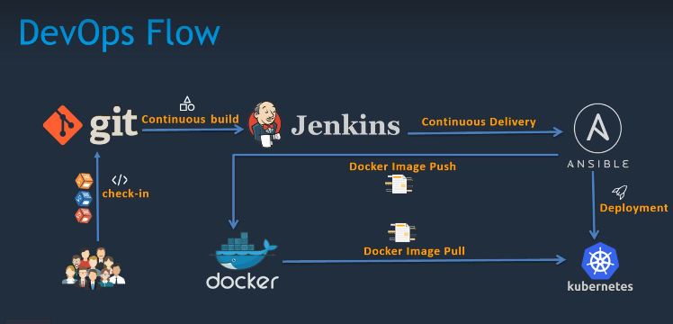

imgs/2020-06-09-08-12-49.png

# Technologien

1. git
Sourcecodemgmt
 
---

2. Jenkins
Create CICD-Pipeline
 
---

3. Maven
Build the tool
 
---

4. Ansible
Config-Mgmt
 
---

5. Docker
Target Env
 
---

6. K8s
Manage Docker Container

 
---

Alles auf AWS

