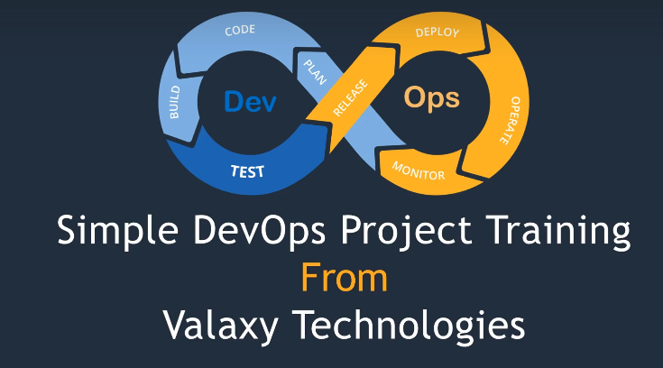
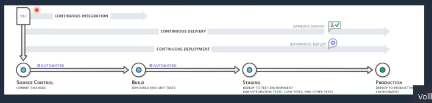
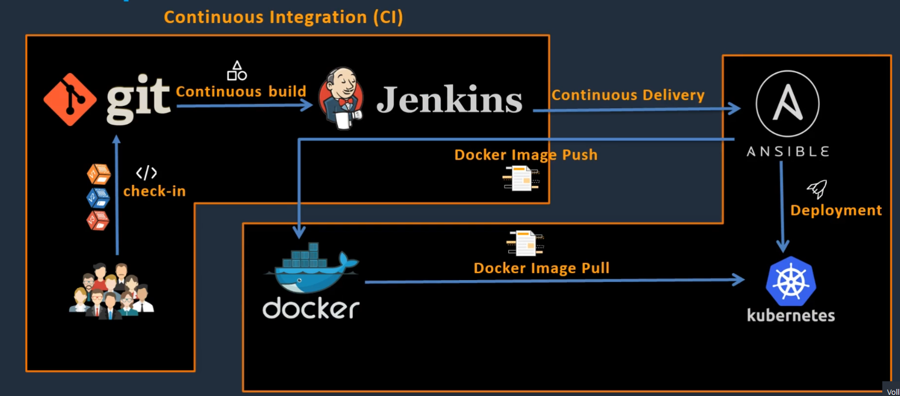

# Intro CI/CD
Conitinous Integration Continious Deployment

What is CI / CD

- Conitinious Integration
- Conitinious Delivery
- Conitinious Deployment
  

  

Im Oberen Bild wird dargestellt wie ein CI 7CD Prozess vonstatten geht

Erklärung Stages:
1. Source Code Controll = Git Management
2. Build = Resultat ist ein **Artefakt**
3. Artefakt kann deployed in staging werden
4. in Staging werden Funktionale und Perofrmance Tests erstellt
5. Sobald das Passt wird in Production Deployed

Unterschied Delivery vs Deployment

1. Delivery = Manual
2. Deployment = Komplett automatisch

