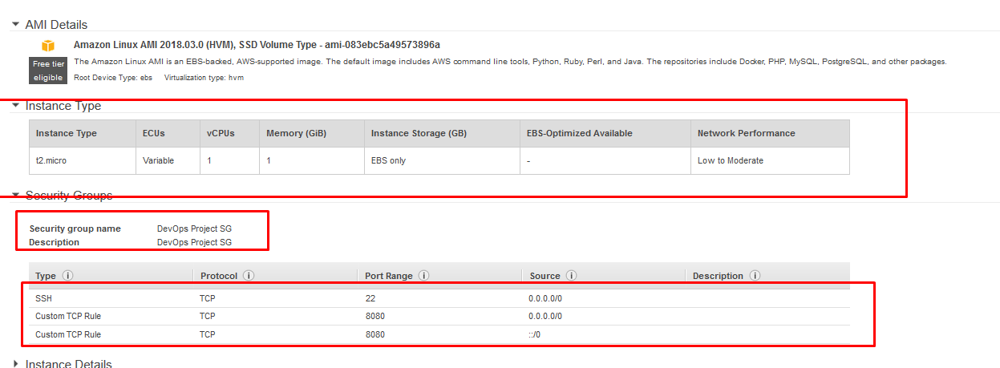
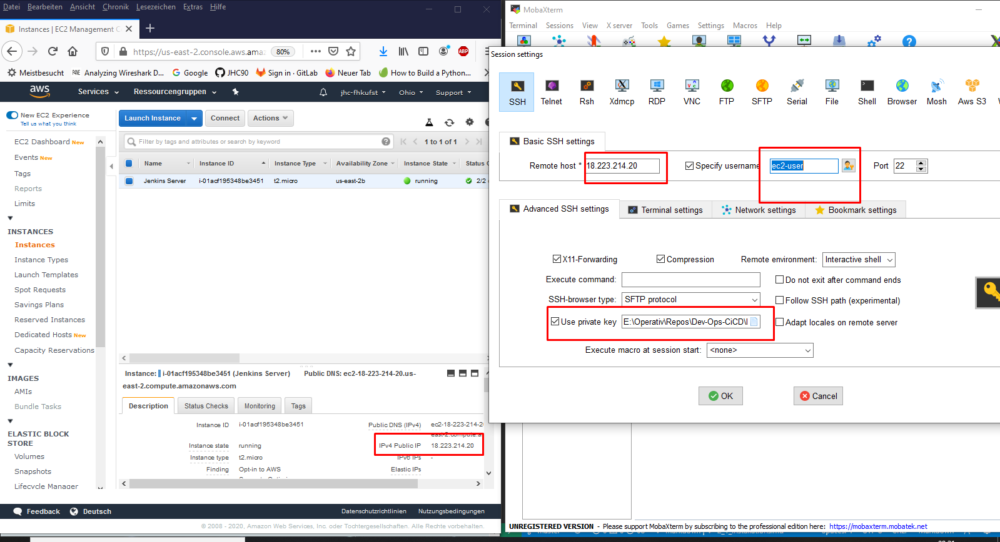

# Hier die Notizen der Installation

## AWS
Hierbei kann ich einen kostenlosesn Probeaccount erstellen
## Git
sollte bereits installiert sein, hierzu verwende ich mein Standard-Git-Account

## Jenkins
Installation hat folgende [Anleitung](https://github.com/JHC90/Simple-DevOps-Project/blob/master/Jenkins/Jenkins_Installation.MD)

Der Jenkins Server kommt auf die AWS-Cloud und hat folgende Configs:

hier die Public IP( die kann man in der AWS-Konsole ablesen):

